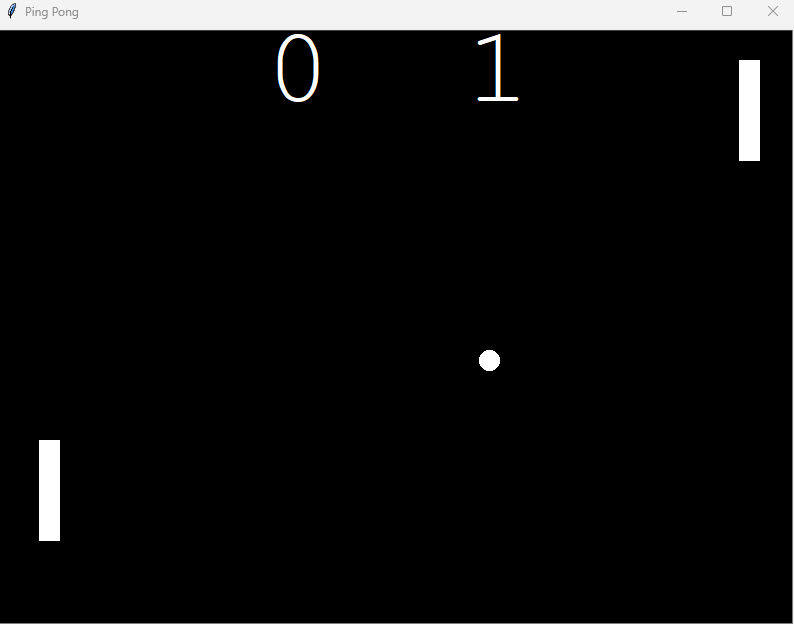

# 🏓 Ping Pong Game 🏓

## Description

This is a simple implementation of a ping pong game using the Python Turtle graphics library. The game allows two players to control paddles and bounce a ball back and forth, earning points when the opponent misses the ball.

## 🚀 Implementation

The game is implemented in Python and uses the Turtle graphics library for the graphical user interface. The main components of the game are:

- **`Ball` Class**: Represents the ball object with movement and bouncing capabilities. It uses the `Turtle` class from the Turtle graphics library to create a circular shape representing the ball. The ball can move in both the X and Y directions and bounces off the walls and paddles when collisions occur.

- **`Paddle` Class**: Represents the paddles controlled by the players. It also uses the `Turtle` class to create rectangular shapes representing the paddles. Players can control the paddles using specific keys (e.g., 'W', 'S' for Player 1 and the arrow keys for Player 2).

- **`Scoreboard` Class**: Displays the score on the screen for both players. The scoreboard is updated whenever a player scores a point by missing the ball.

- **Game Logic**: The main game loop runs continuously until the game is exited. The loop updates the screen, moves the ball, checks for collisions with walls and paddles, and updates the scoreboard accordingly.

## 🎮 How to Play

1. Clone the repository to your local machine using Git.
2. Make sure you have Python installed on your system.
3. Run the `ping_pong.py` file to start the game.
4. Player 1 (left paddle) controls their paddle using the 'W' and 'S' keys to move up and down, respectively.
5. Player 2 (right paddle) controls their paddle using the arrow keys (Up and Down) to move up and down, respectively.
6. The game ends when one of the players reaches the winning score (default: 5). The player with the higher score wins the game.
7. To exit the game, press the 'Esc' key.

## 🤝 Contribution Guidelines

Contributions are welcome! If you want to contribute to this project, please follow these steps:

1. Fork the repository to your GitHub account.
2. Clone the forked repository to your local machine.
3. Create a new branch with a descriptive name for your feature or bug fix.
4. Make your changes and commit them with clear commit messages.
5. Push the changes to your forked repository.
6. Open a pull request from your branch to the original repository.
7. Describe your changes and why they are valuable.

## 🌟 Acknowledgements

This project was developed as a learning exercise to understand the basics of game development using Python and the Turtle graphics library. The implementation of the game involves concepts of object-oriented programming, collision detection, and game loop logic.

The code for the ping pong game was inspired by [Name of the Tutorial/Resource](link to the tutorial/resource) (if applicable). I express my gratitude to the creators of that resource for providing guidance and insights during the development process.

## 📷 Screenshots

## 🛠️ Requirements

- Python 3
- Turtle graphics library

## 📞 Contact

For any questions, feedback, or suggestions, feel free to contact me:

- Email: [Sachin Rana](sachin.rana205@gmail.com)
- GitHub: [sachinanm](https://github.com/sachinanm)

---

Feel free to customize the README.md file according to your project and add any other relevant information. The README.md serves as documentation and an introduction to your project, and it is essential to provide clear instructions for users and contributors.

 

